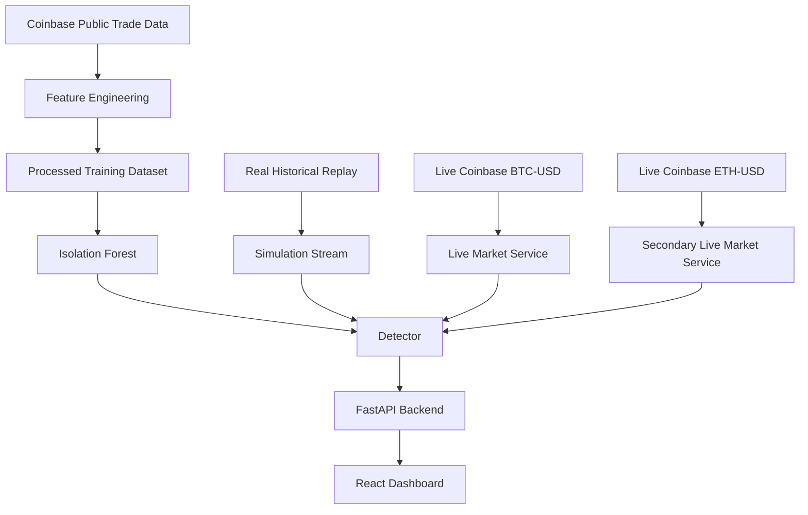

# AI HFT Manipulation Detector

[](https://github.com/Rehan919/hft-ai-detector/actions/workflows/ci.yml)

Production-style market surveillance demo that combines:

- offline anomaly training on real Coinbase trade data
- a dramatic replay simulation with injected confirmed manipulation scenarios
- live public market monitoring for `BTC-USD` and `ETH-USD`
- a FastAPI backend that serves the built React frontend on a single port

## Overview

This project starts from raw trade data with only:

- `timestamp`
- `price`
- `volume`

It then builds rolling statistical features, trains an `IsolationForest` baseline, and scores either:

- replayed historical data
- or live public exchange market data

The simulation mode is intentionally theatrical for demos: it uses real Coinbase history as a base tape, then injects explicit manipulation scenarios that are marked as confirmed simulation cases and elevated to `HIGH_RISK`.

## Modes

### Simulation

- replays a large locally stored BTC-USD tape
- injects recurring synthetic manipulation windows
- raises cinematic `HIGH_RISK` alerts for demo purposes

Injected scenarios include:

- `Open Pump`
- `Flash Dump`
- `Pump Burst`
- `Liquidity Vacuum`
- `Wash Burst`
- `Closing Frenzy`

### Live

- monitors live Coinbase `BTC-USD`
- monitors live Coinbase `ETH-USD`
- analyzes incoming ticks with a more conservative detector configuration

### Holdout Testing

- keeps a separate higher-stress real dataset aside for offline testing
- avoids mixing that holdout into the default baseline training flow

## Architecture



## Detection Output

The detector emits three operator-facing states:

- `NORMAL`
- `SUSPICIOUS`
- `HIGH_RISK`

In live mode, those labels mean "statistically unusual" rather than "manipulation proven."

In simulation mode, injected manipulation cases are explicitly tagged and force a `HIGH_RISK` result so the demo reliably surfaces alerts.

## Project Structure

```text
backend/    FastAPI app, simulation streaming, live market services, detector logic
data/       Real datasets, manifests, generated processed files, live captures
frontend/   React dashboard
model/      Feature engineering, training, saved model artifacts
scripts/    Dataset fetching, dramatic simulation builder, holdout scoring
tests/      Backend and feature tests
config.py   Central settings for data paths, model tuning, API timings, thresholds
```

## Real Data Strategy

The repo uses Coinbase Exchange public market data for both offline preparation and live monitoring.

Generated datasets:

- `data/real/coinbase_baseline_training.csv`
- `data/real/coinbase_fast_simulation.csv`
- `data/real/coinbase_anomaly_holdout.csv`
- `data/real/dataset_manifest.json`

Generated processed outputs:

- `data/processed/training_processed.csv`
- `data/processed/simulation_processed.csv`
- `data/processed/anomaly_holdout_processed.csv`

## Quickstart

### 1. Install backend dependencies

```powershell
python -m venv .venv
.\.venv\Scripts\Activate.ps1
pip install -r requirements.txt
```

### 2. Install and build the frontend

```powershell
Set-Location frontend
npm install
npm run build
Set-Location ..
```

### 3. Generate datasets and simulation tape

```powershell
.\.venv\Scripts\python.exe scripts\fetch_coinbase_datasets.py
.\.venv\Scripts\python.exe scripts\build_dramatic_simulation.py
```

### 4. Train the models

```powershell
.\.venv\Scripts\python.exe model\train.py
.\.venv\Scripts\python.exe model\train_live.py
```

### 5. Start the app

```powershell
.\.venv\Scripts\python.exe -m backend
```

Open:

- [http://127.0.0.1:8000](http://127.0.0.1:8000)

## API

Core endpoints:

- `GET /health`
- `GET /stream`
- `GET /status`
- `POST /reset`

Live endpoints:

- `GET /live/health`
- `GET /live/status`
- `GET /live/coinbase/health`
- `GET /live/coinbase/status`
- `GET /live/secondary/health`
- `GET /live/secondary/status`

## Testing

Run the automated test suite:

```powershell
.\.venv\Scripts\python.exe -m pytest
```

## Docker

```bash
docker compose up --build
```

## Render Deployment

This repo includes [render.yaml](render.yaml) for a single Render web service deployment.

It uses [Dockerfile.backend](Dockerfile.backend) to:

- build the Vite frontend
- copy the built frontend into the FastAPI app
- serve everything from one Render URL

Render setup:

1. Push this repo to GitHub.
2. In Render, create a new Blueprint instance from the repo.
3. Render will detect `render.yaml` and create the `hft-ai-detector` web service.
4. After deploy, open the service URL and the app should be available on the same domain.

Notes:

- The app binds to Render's `PORT` automatically.
- `/health` is configured as the health check path.
- Live Coinbase feeds remain enabled by default.

## Free Frontend Hosting With Local Backend

If you want a no-card option, you can host only the frontend on Netlify and keep the FastAPI backend running on your own machine.

This repo includes [netlify.toml](netlify.toml) for that setup.

How it works:

1. Deploy the frontend to Netlify from this repo.
2. Run the backend locally:

```powershell
.\.venv\Scripts\python.exe -m backend
```

3. Expose your local backend with a public tunnel such as `cloudflared` or `ngrok`.
4. In Netlify, set:

```text
VITE_API_BASE_URL=https://your-public-backend-url.example.com
```

The frontend already reads that variable in [frontend/src/api.js](frontend/src/api.js).

Important limits:

- the site only works while your computer is on
- the backend must stay running locally
- live feeds stop when your local backend stops
- this is good for demos, not for stable production hosting

## CI

GitHub Actions runs:

- backend tests
- frontend production build

Workflow file:

- [`.github/workflows/ci.yml`](.github/workflows/ci.yml)

## Important Notes

- Coinbase public market data is free to access within documented public rate limits, but usage remains subject to Coinbase terms.
- Live alerts are anomaly signals, not proof of spoofing or manipulation.
- Simulation alerts are intentionally exaggerated for demo value.
- Model artifacts and generated CSV outputs are not committed by default.

## References

- [Coinbase Exchange REST trades](https://docs.cdp.coinbase.com/exchange/reference/exchangerestapi_getproducttrades)
- [Coinbase Exchange WebSocket channels](https://docs.cdp.coinbase.com/exchange/websocket-feed/channels)
- [Coinbase Exchange API overview](https://docs.cdp.coinbase.com/exchange/introduction/welcome)
